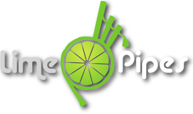

## About

LimePipes is an application for handling and storing music for the great highland bagpipes. It parses `.bww` files from the famous BagpipePlayer from Doug Wickstrom and `.bmw` files from the Bagpipe Music Writer by Robert MacNeil Musicworks and stores them into a database. From there, they can be retrieved and converted to other formats like the more common MusicXML format.

Today, many well known music notation programs are using the MusicXML for interchanging musical compositions.
There has been a bww2mxml tool that ships with [MuseScore](https://musescore.org) but it lacks importing `.bww` files that go beyond basic tunes with no complex time lines (e.g. 2 of 4).

## Project Structure

`cmd`

The project uses the API defined in the [limepipes-api](https://github.com/tomvodi/limepipes-api) project and creates the backend service for it in the directory `limepipes`. The `limepipes-cli` directory contains a command line application which makes it easy to import many tunes at once without the need for a GUI.

`internal/api`

The generated code from the OpenAPI spec and the implementation of the REST service.

`internal/bww`

All the lexing and parsing of `.bww` files is taking place here.

`common/music_model`

This directory contains a music model definition which represents the parsed tunes from a `.bww` file.

`internal/database`

Currently, the parsed tunes are stored in a SQlite database but can be changed to any backend for [GORM](https://gorm.io).

`exporter/musicxml`

Everything used to export the internal music model to a MusicXML file.

## Build

`go mod download` downloads all required dependencies

`go build -o ./limepipes github.com/tomvodi/limepipes/cmd/limepipes` builds the executable

## Develop

As previously mentioned, the application uses an intermediate music model for storing the parsed `.bww` tunes. 
This model is defined in the `common/music_model` directory and has struct tags to be exported to `.yaml` files. This 
is used by many tests to compare the parsed tunes with the expected output.

All enums that must be serialized and deserialized to and from yaml, are handled with [Enumer](https://github.com/dmarkham/enumer)
generate the necessary code.

The `test` directory contains `.http` test files used by GoLand from JetBrains to test the REST API manually.

The `Makefile` contains targets for many build and test tasks.

### Used libraries

- [GORM](https://gorm.io) for database access
- [OpenAPI Generator](https://openapi-generator.tech) for the REST API
- [Enumer](https://github.com/dmarkham/enumer) for enum handling like serializing and deserializing
- [Cobra](https://github.com/spf13/cobra) for command line argument parsing
- [Viper](https://github.com/spf13/viper) for configuration handling
- [Gin](https://github.com/gin-gonic/gin) for the REST API server

